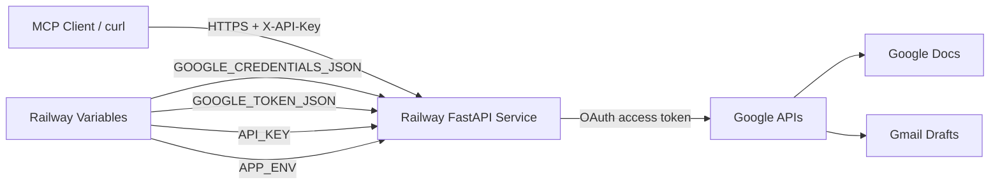

# Railway Deployment Plan — Google MCP Server

This document is a step-by-step plan for deploying the Google MCP Server (FastAPI + Google Docs/Gmail) to [Railway](https://railway.app).

It covers the required code changes, Railway configuration, secret management, verification, and ongoing operations.

---

## 1. Overview

### What we are deploying

A FastAPI app exposing two POST endpoints:

- `POST /append_to_doc` — appends text to a Google Doc
- `POST /create_email_draft` — creates a Gmail draft

### Why the current code needs changes first

The app works locally but relies on four things that are unavailable in a cloud container:

| Local behavior | Why it breaks on Railway | Fix |
|---|---|---|
| `input("Approve? (y/n)")` in `server.py` | No interactive terminal in cloud | Replace with API-key auth (auto-approve in prod) |
| `flow.run_local_server()` in `auth.py` | No browser / no localhost callback | Pre-generate `token.json` locally, inject via env var |
| Reads `credentials.json` / `token.json` from disk | Ephemeral filesystem; secrets must not be in git | Load from environment variables |
| Hardcoded port `8000` | Railway injects a dynamic `$PORT` | Read `PORT` from env |

---

## 2. Target Architecture



---

## 3. Implementation Order (high level)

```
1. Code changes (env-based auth, API key, /health, PORT binding, Procfile)
        ↓
2. Test locally in "production mode" with env vars
        ↓
3. Push to a private GitHub repo
        ↓
4. Create Railway project + set secret variables
        ↓
5. Deploy + smoke-test endpoints
        ↓
6. (Optional) Add MCP protocol layer for native Cursor integration
```

---

## 4. Phase 0 — Code Changes (required)

These changes must be made and committed before deploying.

### 4.1 `auth.py` — support environment-based credentials

Goal: in production, read credentials/token from env vars and never open a browser.

Logic to implement:

- If `GOOGLE_TOKEN_JSON` env var is set → build `Credentials` from that JSON.
- Else if `token.json` file exists → use it (local dev).
- If `GOOGLE_CREDENTIALS_JSON` env var is set → use it instead of `credentials.json`.
- If the token is expired but has a refresh token → call `creds.refresh(Request())` (works headless).
- If no valid token AND running in production → raise a clear error instead of calling `run_local_server()`.

> **Note on detecting production:** Railway automatically injects a `RAILWAY_ENVIRONMENT` variable into every deployment (you do **not** set it yourself). We also define our own `APP_ENV` toggle so the same code can be forced into production mode locally for testing. `_is_production()` treats either signal as "production".

Example shape:

```python
import json
import os

def _load_token():
    raw = os.getenv("GOOGLE_TOKEN_JSON")
    if raw:
        return Credentials.from_authorized_user_info(json.loads(raw), SCOPES)
    if TOKEN_FILE.exists():
        return Credentials.from_authorized_user_file(str(TOKEN_FILE), SCOPES)
    return None

def _is_production() -> bool:
    # APP_ENV is our own toggle; RAILWAY_ENVIRONMENT is auto-set by Railway.
    return os.getenv("APP_ENV") == "production" or bool(os.getenv("RAILWAY_ENVIRONMENT"))
```

### 4.2 `server.py` — production-safe approval (API key)

Replace the interactive `input()` approval with header-based auth.

- Read `API_KEY` from env.
- Require header `X-API-Key` on both POST endpoints.
- In production, skip the terminal `input()` entirely (auto-approve once the API key matches).
- In local dev (when `_is_production()` is false), keep the `input()` prompt if you still want it.

> **Important:** In production `API_KEY` must be set. If it is empty, the check below would let every request through. Fail fast at startup if `_is_production()` is true and `API_KEY` is missing.

Example shape:

```python
import os
from fastapi import Header, HTTPException

API_KEY = os.getenv("API_KEY")

def require_api_key(x_api_key: str = Header(default=None)):
    if not API_KEY:
        # No key configured: block in production, allow in local dev.
        if _is_production():
            raise HTTPException(status_code=503, detail="API_KEY not configured")
        return
    if x_api_key != API_KEY:
        raise HTTPException(status_code=401, detail="Invalid or missing API key")
```

Wire it into each endpoint with FastAPI's dependency injection, e.g. `def append_to_doc_endpoint(request: AppendToDocRequest, _=Depends(require_api_key)):`.

### 4.3 `server.py` — add a health check

```python
@app.get("/health")
def health():
    return {"status": "ok"}
```

Used by Railway's health checks and your smoke tests.

### 4.4 `server.py` — bind to Railway's `$PORT`

```python
if __name__ == "__main__":
    import uvicorn
    port = int(os.environ.get("PORT", 8000))
    uvicorn.run("server:app", host="0.0.0.0", port=port)
```

### 4.5 Add a `Procfile`

```
web: uvicorn server:app --host 0.0.0.0 --port $PORT
```

### 4.6 (Optional) Pin Python version

`runtime.txt`:

```
python-3.12.0
```

### 4.7 Confirm `.gitignore`

Already present and correct — must continue to exclude:

```
credentials.json
token.json
.venv/
__pycache__/
```

---

## 5. Phase 1 — Google Cloud Prep

You already have `credentials.json` and a generated `token.json`. Confirm:

1. **APIs enabled** in Google Cloud Console:
   - Google Docs API
   - Gmail API
2. **OAuth consent screen** is configured; your Google account is a test user (if app is in Testing).
3. **Token is valid** — re-generate locally if needed:

```bash
cd google-mcp-server
source .venv/bin/activate
python -c "from auth import get_credentials; get_credentials()"
```

This refreshes `token.json`, which you will copy into Railway.

---

## 6. Phase 2 — Prepare the Repo

### 6.1 Initialize git (if needed)

```bash
cd /Users/aayush/Documents/MCP_Servers/google-mcp-server
git init
git add server.py auth.py docs_tool.py gmail_tool.py requirements.txt README.md DEPLOYMENT_PLAN.md .gitignore Procfile
git commit -m "Prepare Google MCP server for Railway deployment"
```

Never commit `credentials.json`, `token.json`, or `.venv/`.

### 6.2 Push to a private GitHub repo

```bash
gh repo create google-mcp-server --private --source=. --push
```

---

## 7. Phase 3 — Create the Railway Project

1. Go to [railway.app](https://railway.app) → **New Project**.
2. Choose **Deploy from GitHub repo**.
3. Select `google-mcp-server`.
4. Railway auto-detects Python (Nixpacks) via `requirements.txt`.

### Service settings

| Setting | Value |
|---|---|
| Root directory | `/` (or `google-mcp-server/` if part of a monorepo) |
| Start command | `uvicorn server:app --host 0.0.0.0 --port $PORT` |
| Health check path | `/health` |
| Region | Closest to you |

---

## 8. Phase 4 — Configure Secrets (Railway Variables)

In **Railway → your service → Variables**, add:

| Variable | Value | Notes |
|---|---|---|
| `GOOGLE_CREDENTIALS_JSON` | Contents of `credentials.json` | One-line JSON |
| `GOOGLE_TOKEN_JSON` | Contents of `token.json` | One-line JSON |
| `API_KEY` | Strong random string | Sent by clients as `X-API-Key` |
| `APP_ENV` | `production` | Enables headless/auto-approve mode |

> Do **not** add `RAILWAY_ENVIRONMENT` yourself — Railway sets it automatically in every deployment. Your code already treats its presence as "production"; `APP_ENV` is only needed to force production mode when testing locally.

### Helper commands

Convert files to one-line JSON for pasting:

```bash
cat credentials.json | python -c "import sys,json; print(json.dumps(json.load(sys.stdin)))"
cat token.json       | python -c "import sys,json; print(json.dumps(json.load(sys.stdin)))"
```

Generate a strong API key:

```bash
openssl rand -hex 32
```

---

## 9. Phase 5 — Deploy & Verify

### 9.1 Deploy

Railway deploys automatically on push. Watch **Deployments → Build Logs → Deploy Logs**.

### 9.2 Generate a public URL

Railway → **Settings → Networking → Generate Domain**, e.g.:

```
https://google-mcp-server-production.up.railway.app
```

### 9.3 Smoke tests

Health:

```bash
curl https://YOUR-APP.up.railway.app/health
# Expected: {"status":"ok"}
```

Append to doc:

```bash
curl -X POST https://YOUR-APP.up.railway.app/append_to_doc \
  -H "Content-Type: application/json" \
  -H "X-API-Key: YOUR_API_KEY" \
  -d '{"doc_id": "YOUR_DOC_ID", "content": "Deployed from Railway!\n"}'
```

Create Gmail draft:

```bash
curl -X POST https://YOUR-APP.up.railway.app/create_email_draft \
  -H "Content-Type: application/json" \
  -H "X-API-Key: YOUR_API_KEY" \
  -d '{"to": "you@example.com", "subject": "Railway test", "body": "It works!"}'
```

### 9.4 Check logs

Railway → **Deployments → View Logs**. Confirm:

- Server started on `0.0.0.0:$PORT`
- No `Missing credentials.json` errors
- No attempt to run `run_local_server`
- Google API calls return 200

---

## 10. Phase 6 — (Optional) Native MCP Integration with Cursor

The current server is a **REST API**, not a full MCP protocol server (stdio/SSE with `tools/list` and `tools/call`). To let Cursor auto-discover the tools, either:

- Wrap the REST endpoints in a thin MCP adapter, or
- Add MCP transport using the `mcp` Python SDK on top of the existing tool functions.

Once available, register it (example):

```json
{
  "mcpServers": {
    "google-tools": {
      "url": "https://YOUR-APP.up.railway.app",
      "headers": { "X-API-Key": "YOUR_API_KEY" }
    }
  }
}
```

---

## 11. Ongoing Operations

### Token refresh

- Google access tokens expire (~1 hour). `auth.py` refreshes automatically using the `refresh_token`.
- On container restart, the app reloads `GOOGLE_TOKEN_JSON` from env; the refresh token inside remains valid.
- If refresh fails (revoked token / changed scopes):
  1. Re-run local OAuth to get a new `token.json`.
  2. Update `GOOGLE_TOKEN_JSON` in Railway Variables.
  3. Railway restarts the service automatically.

### Optional: persist refreshed tokens with a Volume

1. Railway → **Add Volume**, mount at `/data`.
2. Update `auth.py` to read/write `/data/token.json` first, falling back to env.
3. Avoids stale tokens across restarts (adds minor complexity).

### Monitoring

| What | Where |
|---|---|
| Uptime / restarts | Railway dashboard |
| Application errors | Railway deploy logs |
| Google API quota | Google Cloud Console → APIs → Quotas |
| Unauthorized access | Watch for 401/403 in logs |

---

## 12. Security Checklist

- [ ] `API_KEY` required on all POST endpoints
- [ ] `credentials.json` and `token.json` never committed to git
- [ ] GitHub repo is **private**
- [ ] Google OAuth app stays in Testing until ready for wider use
- [ ] Rotate `API_KEY` if it is ever exposed
- [ ] Consider restricting access (IP allowlist) if only you call it

---

## 13. Cost Estimate

| Tier | Cost | Notes |
|---|---|---|
| Hobby | ~$5/mo credit | Fine for a low-traffic personal server |
| Usage-based | Per vCPU-minute | Idle services still consume some resources |

Expect roughly **$0–5/month** for personal use.

---

## 14. Rollback Plan

1. Railway → **Deployments** → select a previous successful deploy → **Rollback**.
2. Or revert the git commit and push.
3. If auth breaks: paste a fresh `GOOGLE_TOKEN_JSON` and redeploy.

---

## 15. Local Production Simulation

Test production behavior before deploying:

```bash
export GOOGLE_CREDENTIALS_JSON="$(cat credentials.json)"
export GOOGLE_TOKEN_JSON="$(cat token.json)"
export API_KEY="test-key-local"
export APP_ENV="production"

uvicorn server:app --host 0.0.0.0 --port 8000
```

Then test:

```bash
curl -X POST http://localhost:8000/append_to_doc \
  -H "Content-Type: application/json" \
  -H "X-API-Key: test-key-local" \
  -d '{"doc_id": "YOUR_DOC_ID", "content": "Local prod test\n"}'
```

---

## 16. File Checklist

| File | Status | Purpose |
|---|---|---|
| `server.py` | Needs edit | API key auth, `/health`, `$PORT` |
| `auth.py` | Needs edit | Env-based credentials, headless |
| `docs_tool.py` | No change | Docs append logic |
| `gmail_tool.py` | No change | Gmail draft logic |
| `requirements.txt` | No change | Dependencies |
| `Procfile` | Add | Start command |
| `runtime.txt` | Optional | Pin Python version |
| `.gitignore` | OK | Excludes secrets |
| `DEPLOYMENT_PLAN.md` | This file | Deployment guide |

---

## Next Step

Implement Phase 0 (the code changes for env-based auth, API-key middleware, health check, `$PORT` binding, and `Procfile`), then proceed to Phases 2–5 to go live.
